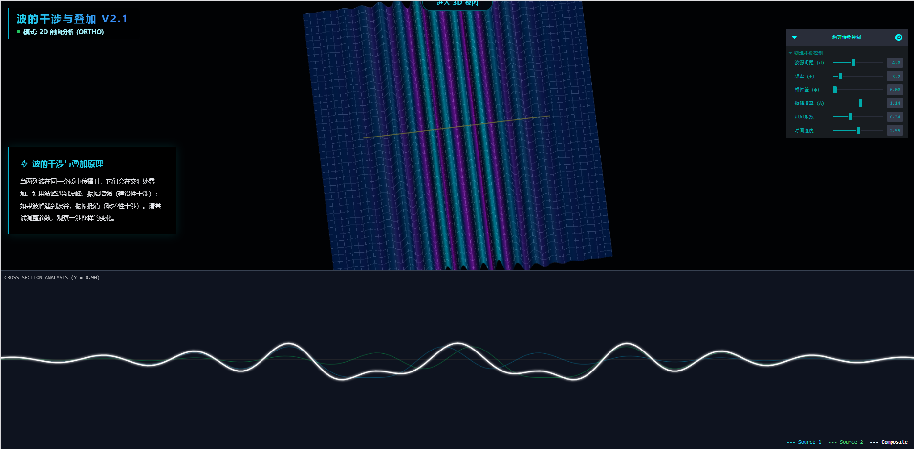

# 波的干涉与叠加原理虚拟仿真实验 (Wave Interference Simulation V2.1)

这是一个基于 Web 的交互式物理仿真项目，旨在直观展示波的干涉与叠加原理。项目采用 React 和 Three.js 开发，支持在 2D 剖面分析与 3D 全息视图之间无缝切换，并提供实时的物理参数调控。


*(如果图片不存在，请在仓库中添加截图)*

## 🌟 主要功能 (Features)

- **多维视图切换**:
  - **2D 剖面分析模式**: 传统物理教学视角，包含顶视图热力图和底部实时波形横截面分析。
  - **3D 全息交互模式**: 沉浸式 GLSL 着色渲染，支持自由旋转 (OrbitControls)、缩放，观察波的立体形态。
- **实时物理引擎**:
  - 动态计算 `A sin(kr - ωt + φ)`。
  - 支持调节 **波源间距 (Separation)**、**频率 (Frequency)**、**相位差 (Phase)**、**振幅 (Gain)**、**阻尼 (Damping)** 等参数。
- **高性能渲染**:
  - 使用自定义着色器 (ShaderMaterial) 进行顶点位移计算，保证百万级顶点的流畅运行。
  - 底部波形图采用 Canvas 2D 优化绘制。
- **物理原理教学**:
  - 内置交互式教学面板，根据用户调节的参数实时解释对应的物理原理（如 Δx = λL/d）。

## 🛠️ 技术栈 (Tech Stack)

- **核心框架**: [React 18](https://react.dev/) + [Vite](https://vitejs.dev/)
- **3D 引擎**: [Three.js](https://threejs.org/) + [@react-three/fiber](https://docs.pmnd.rs/react-three-fiber)
- **辅助库**: [@react-three/drei](https://github.com/pmndrs/drei) (相机控制, 环境)
- **UI 组件**: [TailwindCSS](https://tailwindcss.com/) (样式), [Leva](https://github.com/pmndrs/leva) (参数控制面板)
- **语言**: JavaScript (ES6+), GLSL (Shaders)

## 🚀 快速开始 (Getting Started)

### 环境要求 (Prerequisites)
- **Node.js**: 建议版本 >= 16.0.0
- **包管理器**: npm 或 yarn

### 安装步骤 (Installation)

1. 克隆仓库:
   ```bash
   git clone <你的仓库地址>
   cd wave-physics-simulation
   ```

2. 安装依赖:
   ```bash
   npm install
   # 或者
   yarn install
   ```

3. 启动开发服务器:
   ```bash
   npm run dev
   ```

4. 打开浏览器访问:
   一般地址为 `http://localhost:5173`。

## 📦 项目结构 (Project Structure)

```
src/
├── components/
│   ├── UnifiedWaveScene.jsx   # 核心 3D/2D 场景 (包含 GLSL Shader)
│   ├── CrossSectionGraph.jsx  # 底部 2D 波形分析组件
│   └── PhysicsExplainer.jsx   # 物理原理文字解释面板
├── utils/
│   └── physics.js             # 纯数学物理计算函数
├── App.jsx                    # 主入口与布局逻辑
└── index.css                  # Tailwind 全局样式
```

## 🤝 贡献 (Contributing)

欢迎提交 Issue 或 Pull Request 来改进物理算法或视觉效果。

## 📄 许可证 (License)

本项目采用 MIT 许可证。详见 LICENSE 文件。
